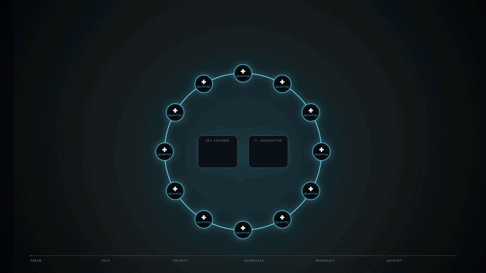
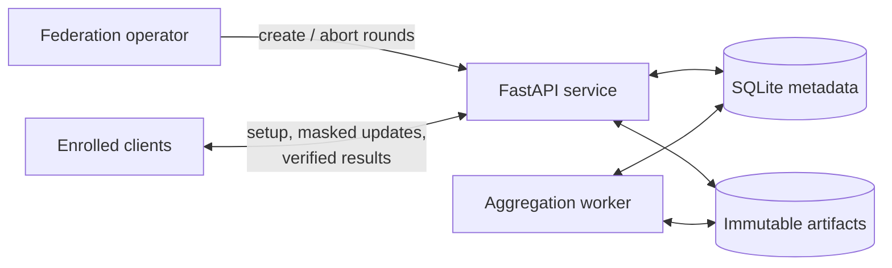

<div align="center">

# deki-smpc Server

### The coordination service for privacy-preserving federated learning

Run secure aggregation rounds, collect masked updates, and publish results that
every participant can verify.

<a href="https://www.python.org/">
  
</a>
<a href="https://fastapi.tiangolo.com/">
  
</a>
<a href="docs/protocol-v1.1.md">
  
</a>
<a href="LICENSE">
  
</a>

</div>

---

`deki-smpc-server` is the service-side half of deki-smpc's secure multi-party
computation system. It coordinates a fixed group of federated learning
participants while the companion `deki-smpc` client protects each site's model
update and verifies the combined result.

The server handles the operational work, including authentication, round
progress, durable storage, aggregation jobs, deadlines, and cleanup, without requiring
access to any participant's individual update in the clear.

> The service is a coordinator and calculator, not a trusted holder of private
> model updates. Clients mask before upload and verify after aggregation.

## Overview

A federation operator enrolls the participating organizations once. For each
training step, the operator opens a round for a specific participant set and
model schema. deki-smpc then moves every participant through the same short flow:

<p align="center">
  
</p>

The API keeps participants synchronized and persists every state transition.
Under default protocol `1.1`, clients aggregate model keys through parallel
groups and a binary tree. The worker adds masked tensor artifacts, but their
aggregate remains masked from the service; clients decrypt the final key,
unmask, and verify locally.

### What the server provides

- **Round coordination:** one authenticated state machine keeps the operator
  and all committed participants in sync.
- **Durable execution:** round metadata, immutable model artifacts, jobs, and
  audit events survive process restarts.
- **Safe retries:** idempotency keys make repeated requests predictable while
  leases let workers recover interrupted jobs.
- **Operational controls:** health endpoints, deadlines, retention cleanup,
  bounded artifact sizes, and graceful shutdown behavior.
- **A small deployment footprint:** one FastAPI service, one aggregation
  worker, and one shared durable volume for the supplied single-host setup.

## Quick start

The included Compose setup starts a local three-participant federation with
development-only identities and tokens. It binds the API to
`127.0.0.1:8080`.

```bash
docker compose up --build -d api worker
curl --fail http://127.0.0.1:8080/health/ready
```

Open <http://127.0.0.1:8080/docs> to explore the API, then stop the services
with:

```bash
docker compose down
```

This local configuration intentionally uses plain HTTP and embedded demo
credentials. Production deployments require TLS, real secret management, a
durable volume, and an enrollment manifest controlled by the federation
operator. See the **[deployment guide](docs/deployment.md)** before exposing a
service.

## Architecture



The supplied deployment has two process roles:

| Component | Responsibility |
| --- | --- |
| **API** | Authenticate requests, validate protocol artifacts, coordinate barriers, and commit state transitions |
| **Worker** | Aggregate artifacts, publish results, and run maintenance |

Both processes share a SQLite database and an fsync-backed artifact directory
on one durable volume. This design supports one durable host and can run
multiple API or worker processes on that host. The documented storage
interfaces define the boundary for a future multi-host backend.

## Deployment at a glance

| | Requirement |
| --- | --- |
| Runtime | Python 3.12+ or Docker with Compose v2 |
| Processes | At least one API and one aggregation worker |
| Storage | Shared durable volume mounted at `/data` |
| Authentication | Operator token plus one token and Ed25519 public key per participant |
| Network | TLS termination at the service ingress |
| Federation | A fixed set of at least three enrolled participants |

Configuration is provided through environment variables. The most important
ones are:

| Variable | Purpose |
| --- | --- |
| `DEKI_ADMIN_TOKEN` | Authenticates round-management requests |
| `DEKI_FEDERATIONS_JSON` | Enrolls federations, participant tokens, and public identity keys |
| `DEKI_DATABASE_PATH` | Selects the SQLite metadata file |
| `DEKI_ARTIFACT_PATH` | Selects the immutable artifact directory |
| `DEKI_ROUND_TTL_SECONDS` | Sets the default round deadline |
| `DEKI_RETENTION_SECONDS` | Controls cleanup of finished rounds |

The [deployment guide](docs/deployment.md) contains the full configuration
reference, resource-planning guidance, and production topology.

## Client and server

deki-smpc deliberately separates the participant-facing library from the service:

| Repository | For | Responsibility |
| --- | --- | --- |
| **`deki-smpc`** | Participating sites | Protect updates and verify results |
| **`deki-smpc-server`** (this repository) | Service operators | Coordinate rounds and publish aggregates |

Release `1.0.1` of both repositories defaults new rounds to wire protocol
`1.1`. Keep the repositories as siblings when running the full integration
suite.

## End-to-end demo

With `deki-smpc` and `deki-smpc-server` checked out next to one another, the
Compose profile runs two API processes, one worker, three independent clients,
and five consecutive verified rounds:

```bash
docker compose --profile e2e -p deki_v1_e2e up --build -d
test "$(docker wait deki_v1_e2e-verify-1)" = "0"
docker compose --profile e2e -p deki_v1_e2e logs verify
docker compose --profile e2e -p deki_v1_e2e down --volumes --remove-orphans
```

<details>
<summary>Run the aggregate-modification scenario</summary>

This adversarial check changes the published result while keeping the artifact
structurally valid. It succeeds only after all three clients reject the
modified aggregate.

```bash
docker compose -f docker-compose.yml -f docker-compose.tamper.yml \
  --profile e2e -p deki_v1_tamper up --build -d
test "$(docker wait deki_v1_tamper-verify-1)" = "0"
docker compose -f docker-compose.yml -f docker-compose.tamper.yml \
  --profile e2e -p deki_v1_tamper down --volumes --remove-orphans
```

</details>

The encrypted-tree tamper scenario is:

```bash
docker compose -f docker-compose.yml -f docker-compose.tree-tamper.yml \
  --profile e2e -p deki_v11_tree_tamper up --build -d
test "$(docker wait deki_v11_tree_tamper-verify-1)" = "0"
docker compose -f docker-compose.yml -f docker-compose.tree-tamper.yml \
  --profile e2e -p deki_v11_tree_tamper down --volumes --remove-orphans
```

For a more approachable training example, start with the client repository's
`docs/getting-started-mnist.md` walkthrough. It covers federation setup, three
local training sites, round creation, and aggregation from beginning to end.

## Documentation

- **[Deployment](docs/deployment.md):** topology, configuration, TLS, storage,
  and resource planning
- **[Operations](docs/operations.md):** health, recovery, retention, and audit
  workflows
- **[API v1](docs/api-v1.md):** operator and participant endpoints
- **[Protocol 1.1 responsibilities](docs/protocol-v1.1.md):** durable group and tree coordination
- **[Architecture decision record](docs/adr/0001-durable-rounds.md):** durable
  round orchestration and storage boundaries
- **[Changelog](CHANGELOG.md):** releases and notable changes

The full cryptographic protocol, wire format, and security model live in the
companion `deki-smpc` repository.

## Security boundary

The aggregation service is treated as untrusted for individual model
confidentiality and aggregate integrity. It sees request metadata and masked
participant artifacts. Protocol `1.1` also hides the final clear aggregate.
Clients reject malformed or modified results.

deki-smpc v1 requires every committed participant to finish a round. Dropout causes
expiry or operator abort, and protection against malicious participant inputs
remains an application and federation-governance responsibility.

## Development

Install both sibling repositories and run the local quality gate:

```bash
python -m pip install -e ../deki-smpc
python -m pip install -e '.[test]'
pre-commit run --all-files
ruff check key-aggregation-server
mypy
python -m pytest -q
```

## Citation

If deki-smpc supports your research, please cite:

> B. Hamm, Y. Kirchhoff, M. Rokuss, P. Schader, P. Neher, S. Parampottupadam,
> R. Floca, and K. Maier-Hein, "Efficient Privacy-Preserving Medical Cross-Silo
> Federated Learning," *IEEE Journal of Biomedical and Health Informatics*,
> pp. 1–14, 2026. <https://doi.org/10.1109/JBHI.2026.3740976>

```bibtex
@article{hamm2026efficient,
  author  = {Hamm, Benjamin and Kirchhoff, Yannick and Rokuss, Maximilian and Schader, Philipp and Neher, Peter and Parampottupadam, Santhosh and Floca, Ralf and Maier-Hein, Klaus},
  title   = {Efficient Privacy-Preserving Medical Cross-Silo Federated Learning},
  journal = {IEEE Journal of Biomedical and Health Informatics},
  year    = {2026},
  pages   = {1--14},
  doi     = {10.1109/JBHI.2026.3740976}
}
```

## License

deki-smpc Server is distributed under the terms of the [MIT License](LICENSE).
